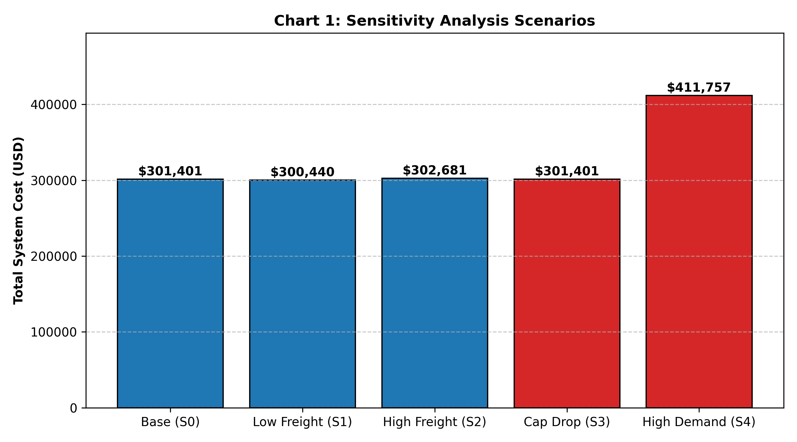
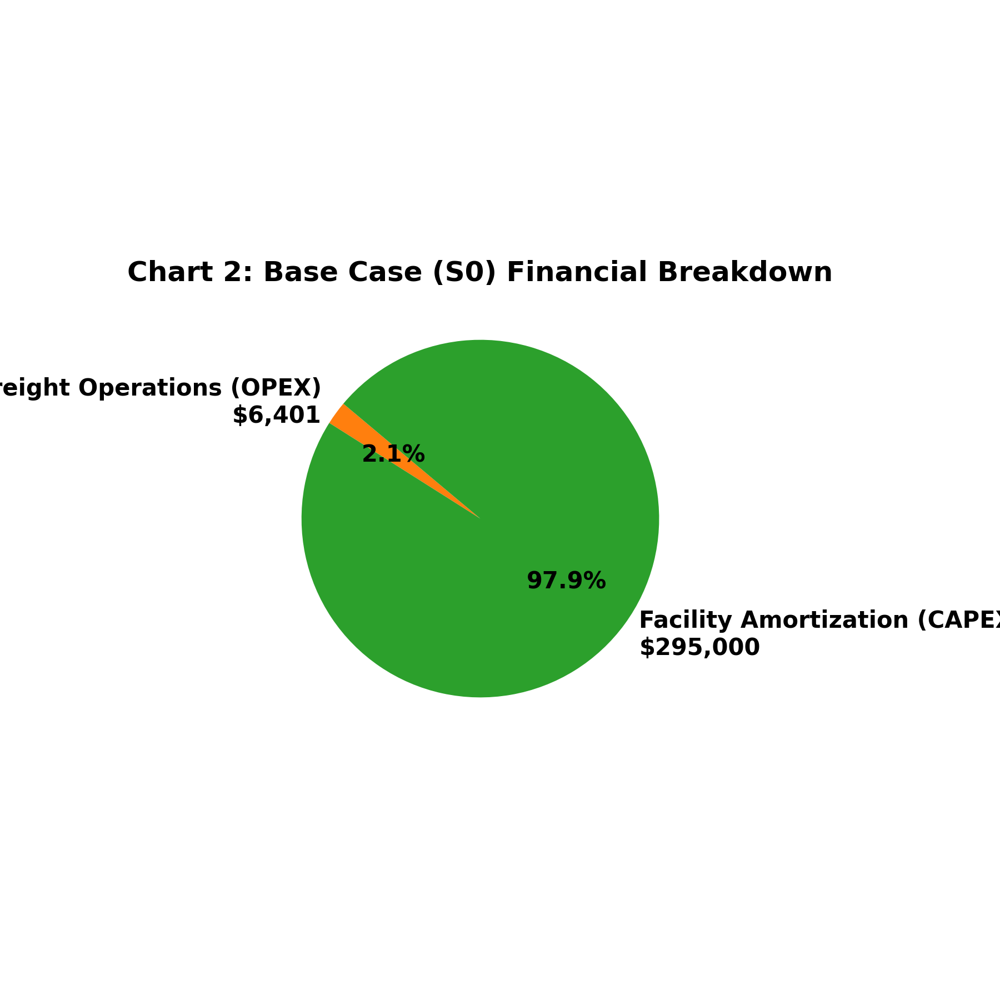
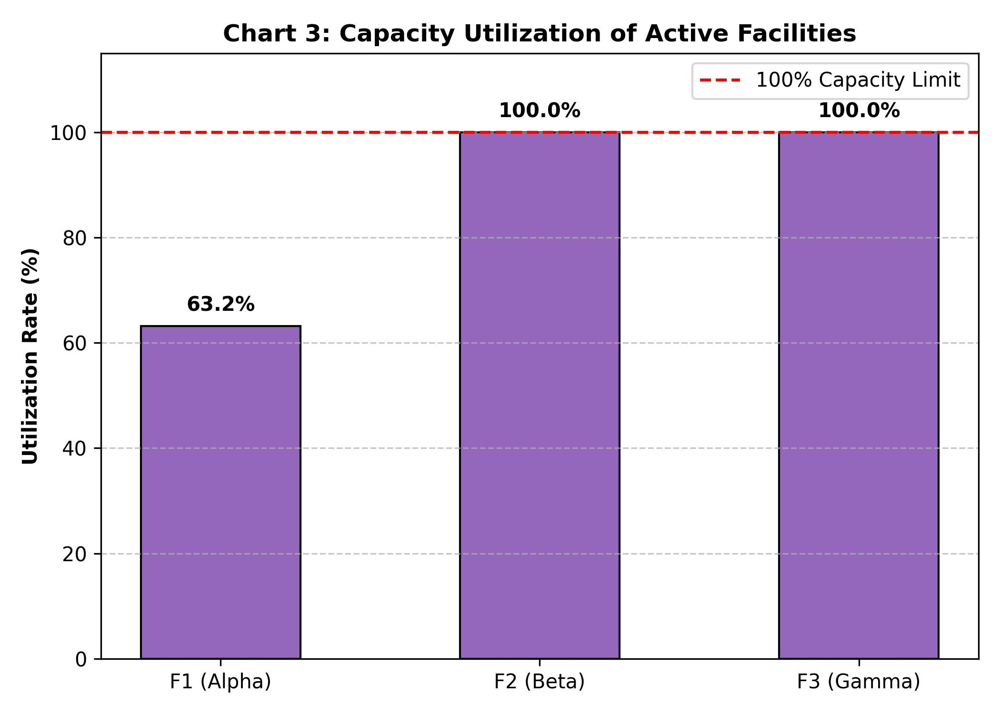
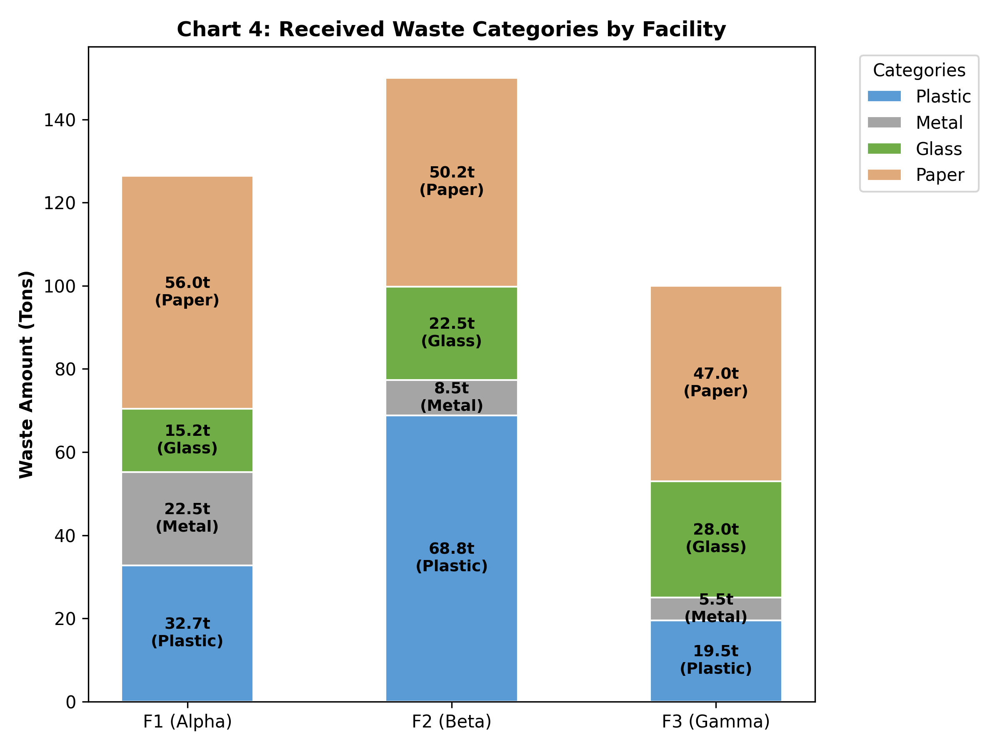

# 🌍 Supply Chain Network Optimization Project: My Engineering Journey

Hi there! I am an Industrial Engineering student, and this is my graduation project (or portfolio project) where I built a Hierarchical Decision Support System for supply chain network design. 

The idea for this project came to me during my internship at a logistics company. I realized that deciding where to open a facility or how to manage freight flow isn't just about "picking a spot." It involves complex math, trade-offs between costs and environment, and a lot of data. I wanted to create a tool that automates this thinking process.

---

## 🛠️ What I Used and Why (Technical Breakdown)

In this project, I didn't just use one method; I combined three different mathematical approaches to make the decision-making process more realistic.

### 1. The Decision Logic (AHP & TOPSIS)
* **AHP (Analytic Hierarchy Process):** I used this to calculate "Criteria Weights." In real life, cost is important, but so is the environment and distance. I used `NumPy` to find the **Eigenvalues and Eigenvectors** of my comparison matrix. This is the "brain" that decides how much we care about each factor.
* **TOPSIS:** After getting the weights, I needed to rank my candidate cities. I used the TOPSIS method because it compares each city to the "Ideal Best" and "Ideal Worst" scenarios. I used `NumPy` again here to **Normalize** the decision matrix so that I could compare USD (costs) with KM (distances) fairly.

### 2. The Optimization Core (MILP)
* **PuLP Library:** This is a Mixed-Integer Linear Programming (MILP) solver. I used it to minimize the total system cost.
    * **Decision Variables:** I defined `Binary` variables for facility opening (1 if open, 0 if closed) and `Continuous` variables for the flow of waste between nodes.
    * **Objective Function:** I wrote a formula that sums up the **Annualized CAPEX** (fixed setup costs) and **OPEX** (transportation costs).
    * **Constraints:** This is where the engineering rules live. I wrote constraints to ensure that every city's waste is collected and no facility works over its capacity.

### 3. Data & Tools
* **SQLite3:** I chose a database instead of a simple Excel file because logistics data is dynamic. Using SQL queries like `SELECT` allows the model to be scalable. If the data changes, the code still works.
* **Matplotlib (with 'Agg' mode):** I used this to create 4 different charts. I specifically used `matplotlib.use('Agg')` so the code can generate and save images in the background without needing a pop-up window, which is better for performance.
* **Pandas:** I used this for the final "Business Intelligence" step. It takes the complex math results from PuLP and converts them into a clean, professional Excel report that a manager could actually read.

---

## 📈 Sensitivity Analysis: Testing the "What-Ifs"

I believe a good engineer always asks "What if?". That’s why I added a **Dynamic Sensitivity Analysis** module. My code doesn't just solve the problem once; it automatically tests 5 different scenarios:
1.  **Base Case:** Everything is normal.
2.  **Low Freight:** What if shipping gets cheaper?
3.  **High Freight:** What if fuel prices jump by 20%?
4.  **Capacity Drop:** What if our main facility in the North has a breakdown?
5.  **High Demand:** What if people start producing 25% more waste?

The model re-calculates everything for each scenario so we can see if our strategy needs to change!

## 📊 Project Visuals & Results

Here are the automated charts generated by my code after running the optimization scenarios:

**1. Scenario Cost Comparison** 

**2. Financial Breakdown (CAPEX vs OPEX)** 

**3. Facility Capacity Utilization** 

**4. Waste Category Distribution** 
---

## 🚀 How to Run the Project

1.  **Install Dependencies:**
    `pip install pulp pandas matplotlib numpy openpyxl`
2.  **Generate the Database:** Since the original data is private, I wrote a script to create a "mock" database for you. Run:
    `python generate_mock_db.py`
3.  **Run the Optimization:**
    `python Supply_Chain_Optimization.py`

Once it finishes, you will see 4 charts (`.png`) and one Excel file (`.xlsx`) in your folder with all the results.

---
*Feel free to reach out if you have any questions about the math or the code. I'm always happy to talk about optimization!*
